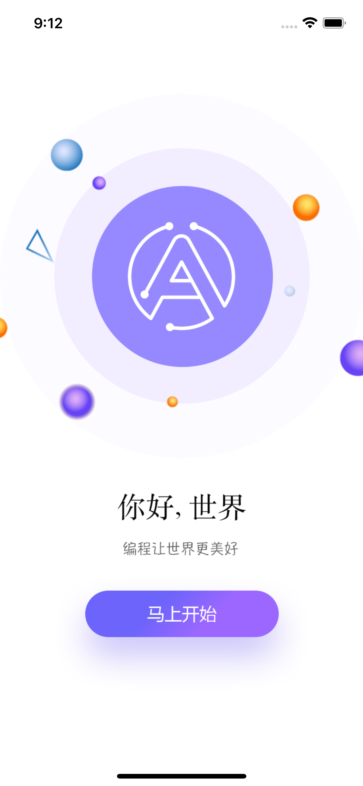
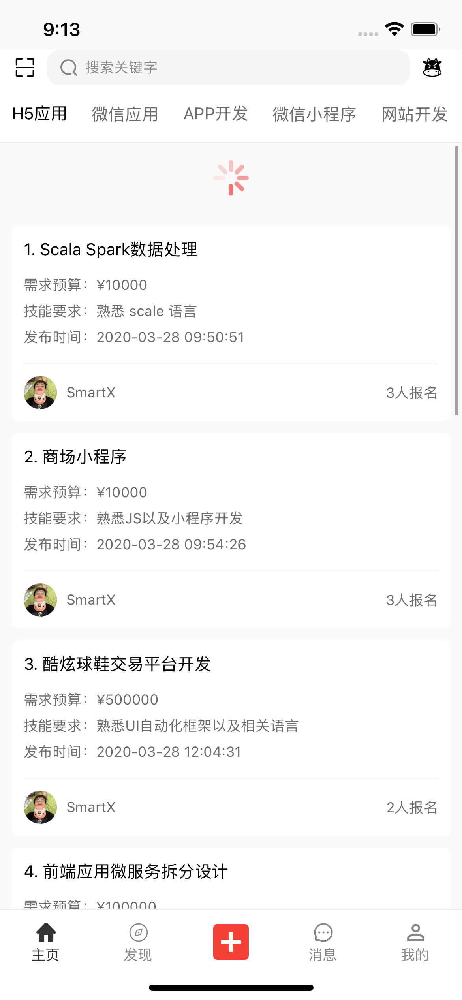
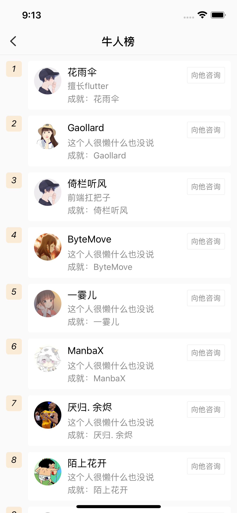
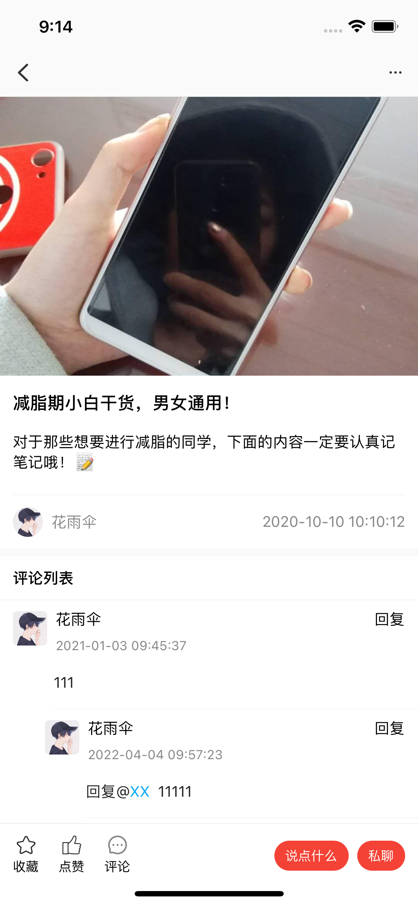
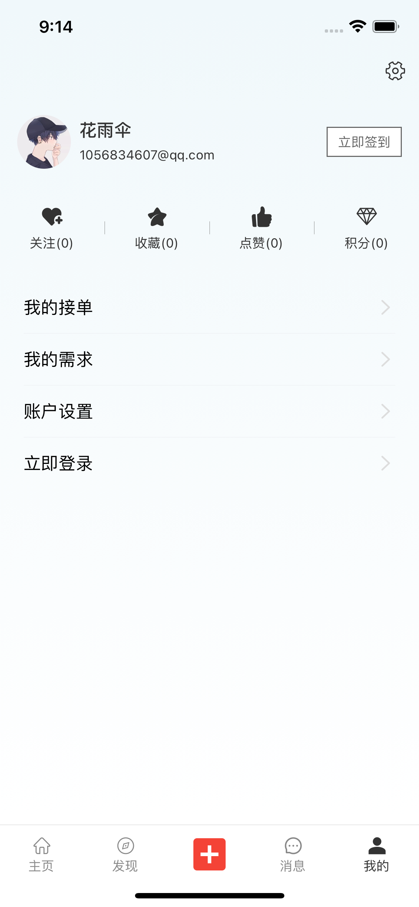
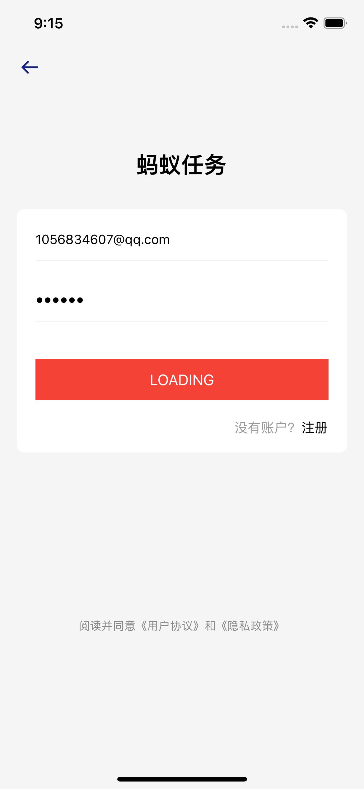
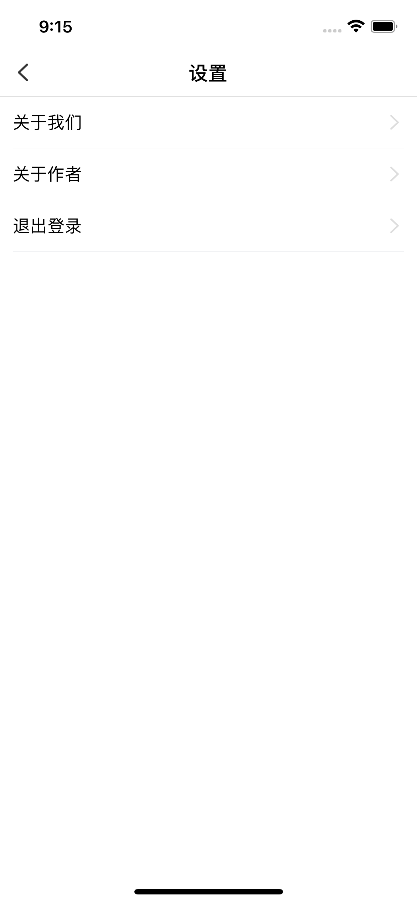

## RenwuRN
语契移动端

### 1. 本地开发

```shell
# 项目初始化
npx react-native init FeiKu --template react-native-template-typescript
```

```shell
# ios pod install
npx pod-install ios
```

```shell
# 编译运行
yarn start
yarn io
yarn android
```

```shell
# iconfont 处理
npx iconfont-init
npx iconfont-rn
```

### 2. 安卓打包
```bash
cd android && ./gradlew assembleRelease
```

### 3. 第三方库
| 名称 | 说明 | 
| - | - |
| [React-Native](https://reactnative.cn) | 开发基础 |
| [react-navigation](https://reactnavigation.org) | 路由工具 |
| [async-storage](https://react-native-async-storage.github.io/async-storage/) | 本地存储 |
| React Native Elements | UI kit | 
| mobx | 状态管理 |
| dva | 状态管理 |
| react-native-config | build env |
| react-native-svg | SVG管理 |
| react-native-iconfont-cli | SVG管理 |
| [ReactNative Base](https://docs.nativebase.io/nb-icons#h2-built-with) | UI kit |
| [react-native-elements](https://reactnativeelements.com/) | UI kit |
| [ant-design-mobile](https://rn.mobile.ant.design/docs/react/introduce-cn) | UI Kit |
| [react-native-image-picker](https://www.npmjs.com/package/react-native-image-picker) | 选择图片 |
| [react-native-cameraroll](https://github.com/react-native-cameraroll/react-native-cameraroll) | 预览图片 ｜
| react-native-tab-view | 滑动导航栏 |
| react-native-sound | 播放音频 |
| react-native-video | 播放视频 |

### 4. 应用截屏

欢迎页  |  首页 | 牛人
:-----:|:-----:|:-----:
 |  | 

<div style="width: 2400px">
  
  
  
  
  
  
  
  
</div>

### 4、code push
```bash
# push
code-push release-react RenwuAndroid android
code-push release-react RenwuAndroid android -d Production

# 查看部署的版本
code-push deployment ls RenwuAndroid
```